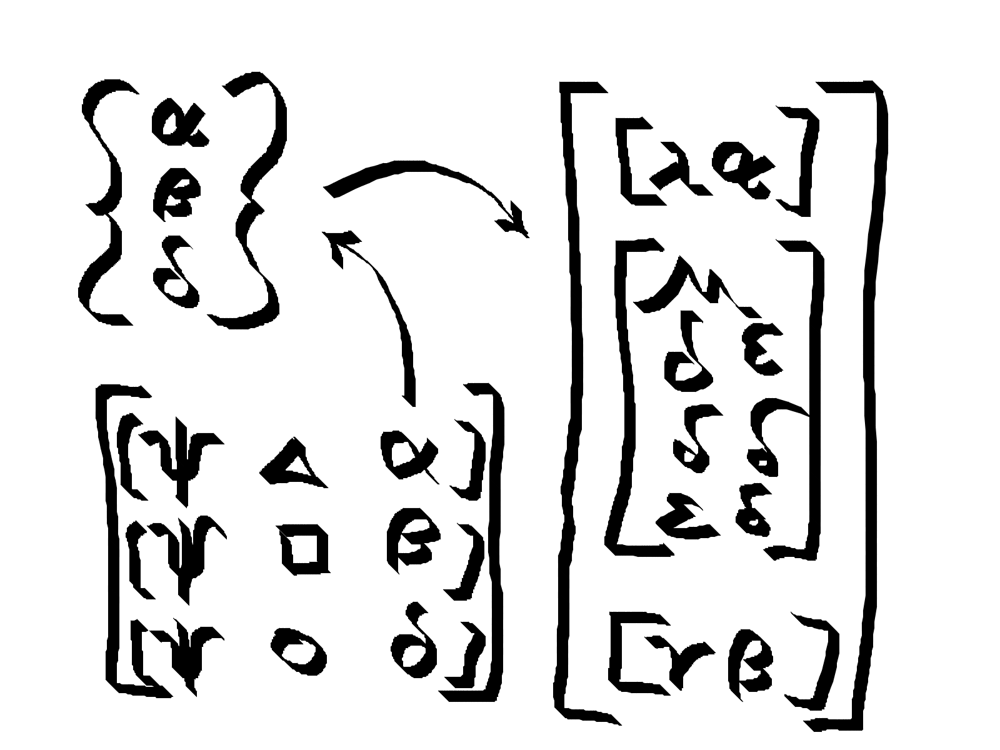

# Justice

A [Clojure/Script](https://clojure.org/) pattern syntax for [Datalog](https://en.wikipedia.org/wiki/Datalog).


## Rationale

Datalog is the front runner tool for flexible data modeling.
Datomic and DataScript provide a robust implementation of Datalog.
But queries in these systems are often expressed as complex code.

> Yesterday I was reviewing a codebase which uses Datomic and Datascript.
> In this project devs use pull syntax as an escape hatch to Clojure:
> do broad query A and pull everything,
> do broad query B and pull everything,
> join A and B in Clojure and project fields.
> It’s so reminiscent of bad practices with ORM.
> However I don’t think you can put the blame entirely on the poor devs.
>
> -- *Anonymous*

Users run into problems when trying to combine and reuse query parts to form new queries.
Queries require rules to compose well and to be scoped.
The built-in rules features take careful planning to wield.
Justice is designed for clear and concise rule creation and composition.

In his keynote,
[Zeno and the tar pit](https://skillsmatter.com/skillscasts/12820-keynote-zeno-and-the-tar-pit),
Christope Grand explains why Datalog is superior to values for modeling data,
and why it is more cumbersome.
Christope presents a syntactic fix for Datalog rule application.

```prolog
ancestor(M,P) :- parent(M,P).
ancestor(M,G) :- parent(M,E), ancestor(E,G).
```

Can be more concisely written as:

```prolog
ancestor(M) := parent(M) | ancestor(parent(M)).
```

The bridging variables P, G, and E are implied.
Justice is an implementation of this transform for DataScript.
Justice follows the convention of using the last parameter as a "result".
This convention maintains the convenience of invoking rules like a function.

DataScript and Datomic already provide a powerful entity abstraction.
Justice offers a concise mechanism for constructing queries that return entities,
and helpers to observe change that affects those entities.
Providing these conveniences encourages the use of entity style over query or pull style.
Abstracting query as navigation removes a tedious layer of incidental complexity;
the maintenance of queries and transformations.

Pattern matching is superior to navigation for conveying meaning.
Seeing a picture of the data is much clearer than reading a description.
Abstracting navigation as pattern matching achieves a pleasing notation for specifying queries.
Justice provides a pattern syntax for concise queries.
This provides several architectural benefits:

1) Less code.
2) Structure is presented visually.
3) Patterns are easily merged.
4) Composition is rule based and obeys scope.
5) Absence of unnecessary boilerplate.

A concise syntax can provide a clear and robust way to express queries as rules.

Data is stored as datoms.
Queries are expressed as entities.
Results are built from the pattern. 



It is time to move beyond maps.
Datalog provides a way to do indexing, schema and query in such a way that we can traverse data as an entity graph efficiently.
Justice provides a clear and concise syntax for expressing entity oriented operations.


## Usage

Justice is in alpha.
The API may change in response to feedback.
I'd love to hear your suggestions.

Add justice to your dependencies:

    [justice "0.0.5-alpha"]

Add [DataScript](https://github.com/tonsky/datascript) to your dependencies.

See [basic examples](examples/basic) for executable code described below.


### DataScript database setup

We need a schema and some data in order to create queries and rules.
Let's start with some facts about people indicating who their parents are.
To keep things simple for this example I will restrict people to only have one parent.

```clojure
(ns basic.setup
  (:require [datascript.core :as d]))

(def schema
  {:entity/parent {:db/valueType :db.type/ref
                   :db/cardinality :db.cardinality/one}})

(def conn
  (d/create-conn schema))

(def seed
  [{:entity/name "Justice"
    :entity/parent {:entity/name "Mother"
                    :entity/parent {:entity/name "Grandmother"
                                    :entity/death "278 BC"}}
    :entity/_parent [{:entity/name "Good Child"}
                     {:entity/name "Bad Child"}]}])

(d/transact! conn seed)
```

The schema defines an `:entity/parent` attribute.
In the example data "Justice" has a parent named "Mother",
who in turn has a parent named "Grandmother".
"Good Child" and "Bad Child" both have "Justice" as their parent.


### Query

Require justice from your code.

```clojure
(ns basic.main
  (:require [justice.core :as j]
            [basic.setup :as s]))
```

Pass a database as the first argument to a query, and a pattern as the second argument.

```clojure
(j/q @s/conn {:entity/parent 1})
;=> (#:db{:id 4} #:db{:id 5})
```

Attaching to a database connection allows us to omit the database argument for subsequent queries.

```clojure
(j/attach s/conn)
```

Now we can query with just the pattern.

```clojure
(j/q {:entity/parent 1})
;=> (#:db{:id 4} #:db{:id 5})
```

The result of our query is a sequence of [entities](https://docs.datomic.com/on-prem/entities.html).
Entities provide a lazy, associative view of all the information that can be reached from an id.
Entities only pull attributes when you access them.
To realize all attributes, use `d/touch`.
When following relations, the schema determines whether the result will be another Entity, a sequence of Entities, or a value.

```clojure
(map :entity/name (j/q {:entity/parent 1}))
;=> ("Good Child" "Bad Child")
```

Our result entities have the names "Good Child" and "Bad Child".


### Pattern syntax

Now let us turn our attention to the pattern of the query; `{:entity/parent 1}`.
This is a pattern describing what we are looking for.
The `{}` notation corresponds to the perception that entities are similar to maps.
The relation `:entity/parent` is defined in our schema as a reference,
so `1` is an entity id.
The pattern can be read as "Find entities that have parent 1".
Indeed `1` is the entity id of "Justice", and "Justice" is the parent of both "Good Child" and "Bad Child".

Let's try a pattern containing multiple attributes.

```clojure
(j/q {:entity/parent 1
      :entity/name "Good Child"})
;=> (#:db{:id 4})
```

Only the "Good Child" entity was returned.
We specified that we wanted the `:entity/name` to be "Good Child" and the parent to be `1`.

An Entity can be supplied instead of an entity id:

```clojure
(j/q {:entity/parent {:db/id 1}})
;=> (#:db{:id 4} #:db{:id 5})
```

We can identify Justice by name, and find entities that have "Justice" as a parent.

```clojure
(j/q {:entity/parent {:entity/name "Justice"}})
;=> (#:db{:id 4} #:db{:id 5})
```

The special symbol `?result` can be used to specify what to retrieve.
If `?result` is absent, as in the previous example,
then we are implicitly searching for an entity that matches the full pattern.
But by providing an explicit `?result` we can specify that we want something else.

```clojure
(j/q '{:entity/name ?result})
;=> ["Good Child" "Grandmother" "Bad Child" "Justice" "Mother"]
```

The symbol `?result` must be quoted.

Here is a more complicated case.

```clojure
(j/q '{:entity/parent {:entity/parent {:entity/name "Grandmother"}}
       :entity/name ?result})
;=> ["Justice"]
```

We search for a pattern where there is an entity that has a parent,
who in turn has a parent, whose name is "Grandmother".
And indeed that is "Justice".

What is this query is asking for, and what will the result be?

```clojure
(j/q '{:entity/name "Justice"
       :entity/parent {:entity/parent {:entity/name "Grandmother"}
                       :entity/name ?result}})
;=> ["Mother"]
```

We explicitly specified `?result` to be an entity name.
The entity it will find is nested inside an outer entity with the name "Justice".
Therefore, the entity that contains `?result` must be a parent of "Justice".
The `?result` occurs inside an entity that also has a parent; an entity named "Grandmother".
And indeed there is one such entity named "Mother".


### Navigation syntax

So far we have specified what we want to find as an entity.
But we can also specify what we want to find as a navigation.
A navigation is very similar to a function call and follows that syntax.

```clojure
(j/q '(:entity/name 1))
;=> ["Justice"]
```

The expression must be quoted to prevent evaluating the expression before the query occurs.
The results of evaluating `(:entity/name 1)` is `nil`, which we do not want as our query.

We asked what is the name of entity 1? And indeed it is "Justice".
We always get back a sequence, even though there is only one possible answer here.
The notation `(:entity/parent Entity)` is consistent with using keywords as get functions,
where we are operating on an entity.

The special symbol `_` means match anything.

```clojure
(j/q '(:entity/name _))
;=> ["Good Child" "Grandmother" "Bad Child" "Justice" "Mother"]
```

Notice that navigation and pattern syntax can be used together.

```clojure
(j/q '(:entity/name {:entity/parent 1}))
;=> ["Good Child" "Bad Child"]
```

We can read this expression informally as "get the name of entities having parent 1."


### Defining rules

An ancestor of a person can be a parent, or the parent's ancestor.
Let's create a rule that captures this relationship.

Rules are defined in a similar way to `defn`:

```clojure
(j/defq descendant [?x]
  {:entity/parent (or ?x (descendant ?x))})
```

Or in navigation syntax:

```clojure
(j/defq ancestor [?x]
  (or (:entity/parent ?x)
      (ancestor (:entity/parent ?x))))
```

The clause `(ancestor (:entity/parent ?x))` implies a recursive application of the rule.
If the input x has a parent, then the final result can be the ancestor of the parent of x.
This notation is consistent with function application.
You can read it informally as "the ancestor of the parent of input x."

The term `or` implies that either clause will match with existing facts.

`defq` adds a rule to the global, namespaced rule registry,
and creates a convenience function of the same name to query it with.


### Applying rules

`defq` created a function that we can invoke.

As with queries, we can pass a database as the first argument to a rule:

    (ancestor @s/conn 1)
    ;=> (#:db{:id 3} #:db{:id 2})

And after attaching, rule applications can omit the database argument:

    (ancestor 1)
    ;=> (#:db{:id 3} #:db{:id 2})

The inputs and results of a rule application may be entities or values.
Justice uses the database schema to determine whether a relation is a ref or not.
Prefer the creation of rules that take and return entities,
as you can navigate to values conveniently using the entity pattern.

The name `defq` has been purposefully chosen to ignore the fact that rules are involved.
It should be possible to use this abstraction without thinking about rules at all.
Instead we can think of `defq` as creating reusable queries.


### Combining queries

Rules are cool when you want recursion and composition,
but rules are not always necessary for queries.

    (j/q (:entity/parent (:entity/parent 1)))
    ;=> (#:db{:id 3})

Here we asked "Who is the grandparent of 1?".
This is the same as:

    (:entity/parent (:entity/parent (d/entity @s/conn 1)))
    ;=> #:db{:id 3}

We can use logic and rules inside justice expressions:

    (j/q '(ancestor (descendant 1)))
    ;=> (#:db{:id 3} #:db{:id 2} #:db{:id 1})

    (j/q '(and
            (:entity/parent 1)
            (:entity/_parent 3)))
    ;=> (#:db{:id 2})

We could save a find query into a function:

    (defn grand-parent [x]
      (j/q `(:entity/parent (:entity/parent ~x))))

But consider using `defq` instead:

    (j/defq grand-parent [?x]
      (:entity/parent (:entity/parent ?x)))

The difference is that `defq` queries are composable.


### Attribute direction

Clauses can be inverted with the `_relation` reverse lookup convention:

    (defq descendant [?x]
      (or (:entity/_parent ?x)
          (descendant (:entity/_parent ?x))))
    (map :entity/name (descendant 1))
    ;=> ("Good Child" "Bad Child")

This notation is consistent with Entity navigation.
Given an Entity `e`, you can find the children of `e` with `(:entity/_parent e)`.
This can be read informally as "Who has parent e?"


### Query direction

Previously we asked "Who are the ancestors of Justice?".
Writing `(ancestor 1)` was actually shorthand for providing both sides of the relation:

    (ancestor 1 '?result)

We were able to leave `'?result` off because it is implied,
and the advantage is that we can think of rules as behaving like a function.

Now we shall ask "Who has Justice as an ancestor?"

    (map :entity/name (ancestor '?x 1))
    ;=> ("Good Child" "Bad Child")

Here we are asking for the `?result` to be 1, for some `?x`.

We can avoid providing both sides of the relation by reversing it:

    (map :entity/name (j/q (_ancestor {:entity/name "Justice"})))
    ;=> ("Good Child" "Bad Child")

`defq` is in fact creating a reusable rule.
Rules can have their direction reversed, using the `_` reverse lookup convention,
analogous to how attribute lookup can be reversed.
This expression can be read informally as "Who has an ancestor named Justice?"


### Cartesian product

Rules can be called with no arguments at all to query all possible answers based on existing facts:

    (->>
      (ancestor)
      (map (partial map :entity/name))
      (sort-by first))
    ;=> (("Bad Child" "Grandmother")
    ;    ("Bad Child" "Mother")
    ;    ("Bad Child" "Justice")
    ;    ("Good Child" "Grandmother")
    ;    ("Good Child" "Mother")
    ;    ("Good Child" "Justice")
    ;    ("Justice" "Grandmother")
    ;    ("Justice" "Mother")
    ;    ("Mother" "Grandmother"))

Supplying no arguments is syntactic sugar for unbound input and result `(ancestor '?x '?result)`.


### Truth checking

Rules can be called with 2 arguments to test if the rule holds:

    (ancestor 1 3)
    ;=> true

    (ancestor 1 5)
    ;=> false


### Composing rules

Rules can make use of other rules:

    (j/defq dead-ancestors [?x]
      (and (:entity/_death _)
           (ancestor ?x)))
    (map :entity/name (dead-ancestors {:entity/name "Justice"}))
    ;=> ("Grandmother")

While it appears that `dead-ancestors` applies `ancestor` directly,
this is not the case.
What really happens here is that justice produces a set of dependent rules,
which are used in a query.
This is important to understand, as it explains why regular functions cannot appear in rules.


### Where clauses

Notice that in the `dead-ancestors` rule, the first clause `(:entity/_death _)` does not relate to the input `?x`.
It does however implicitly relate to the `?result`.
Thus a restriction has been made that the result entity has an `:entity/death`.
This is analogous to a "where" clause in SQL.

You can use the same approach to introduce new logic variables.
We could have introduced `?death` to be bound to "date of death" instead of the ignoring the value with `_`.
Thus we can chain together conditions with other clauses.


### Select clauses

Justice does not produce "row" results (non-Entities).
Results are intended to be either scalars or navigated using the Entity interface.
Rows can be approximated with `(juxt :field1 :field2)`to produce a function that will call `:field1` and `:field2` on an Entity,
but the Entity abstraction is preferable for both clarity and performance.

Note that where one might otherwise want two separate Entities returned side by side,
it is possible to instead split the query into two parts...
Finding one of the Entities, and finding the related Entity.
Keep in mind that this all reduces down to in memory map lookups,
so splitting queries up does not necessarily imply extra overhead.


### Rule arity

You can define rules that take many arguments instead of just 1.

    (defq example [?x ?y ?z])

You can define rules that accept multiple arities similar to `defn`:

    (defq example ([?x] ...) ([?x y?] ...))

But you cannot define rules with variadic arguments:

    (defq example [?x & ?more])
    ;=> ERROR

See the "Relations" section for more information on this limitation.


### Debugging rules

Having rules be self contained functions makes it easier to invoke them in isolation while debugging.

Sometimes it is helpful to see the DataScript that a justice rule will produce.
Calls to rules wrapped with `trace` will print out the underlying DataScript query being made and return the result.

    (j/trace
      (ancestor 1))
    ;;; QUERY:
    ;   (datascript.core/q
    ;    {:find [[?result ...]],
    ;     :in [$ % ?a _],
    ;     :where [(basic.main/ancestor ?a ?result)]}
    ;    [[(basic.main/ancestor ?x ?result)
    ;      [?x :entity/parent ?result]]
    ;     [(basic.main/ancestor ?x ?result)
    ;      [?bridge_23980 :entity/parent ?result]
    ;      (basic.main/ancestor ?x ?bridge_23980)]]
    ;    1
    ;    ?y)
    => (#:db{:id 3} #:db{:id 2})

You can also look in the rule registry at `*rule-registry*`.

Rules are stored in a map of `rule-name` -> `[[(rule-name ?a ?b) [clause]+]]`.


### Aggregates

A syntax for aggregation is not (yet) provided.
Entities are amenable to aggregate operations.
You can use Clojure's built in aggregates to operate over the sequence of entities produced.

    (count (ancestor 1))
    ;=> 2

Entity navigation can be utilized for more complex aggregations.

DataScript supports aggregations, but it's not clear to me how they would work with this syntax.


### Namespaces

When registering a rule, rule names are prefixed by the current namespace.
The full name of our `ancestor` rule is `example.basic/ancestor`.

When applying a rule from within another rule, justice fully qualifies the short name with the current namespace.
We call `ancestor` from `dead-ancestor` by it's short name because the code for both is in the same namespace.

To call a rule from a different namespace from within a rule you must use the fully qualified name.
For example for `dead-ancestor` in `basic.example` to apply `my-rule` in `other.ns`,
it must do so using the full name `other.ns/my-rule`.
No namespace aliasing is provided (yet).

We can define another rule with the same short name in another namespace without collision.
Two versions of `ancestor` can exist as `example.basic/ancestor` and `other.ns/ancestor`, as different rules.

The fully qualified names produced by for the generated query aid in debugging;
the name indicates where the rule is defined in the source code.


### Transacting

Justice provides `transacte` which behaves very similar to `d/transact!` but returns the first entity.

`assox` operates on an entity to produce a transaction, transacts it, and returns a new entity.

`updatex` operates on an entity to produce a transaction, transacts it, and returns a new entity.

`dissox` operates on an entity to produce a transaction, transacts it, and returns a new entity.


### Reacting to change

Justice provides a `reactive` namespace with several helpers to assist listening to change.
These are intended for use in React UIs, and similar scenarios.


### Warning: justice without mercy

It is possible to express non-terminating recursive rules in justice,
just as it is in Datalog.


### Escaping the justice system

The justice syntax is more concise than DataScript queries and handles several shorthand conventions.
These conventions restrict what can be expressed in a query.

The `?result` symbol is special, it is always bound to the final result.

    (j/defq ancestor* [?x]
      (or [?x :entity/parent ?result]
          (and [?x :entity/parent ?z]
               (ancestor* ?z ?result))))
    (map :entity/name (ancestor* 1))
    ;=> ("Grandmother" "Mother")

This new rule `ancestor*` is equivalent to the original `ancestor`,
but has been expressed in relation triple clauses.

Triple relations will have their direction swapped where the `/_` reverse lookup convention is used,
in the same way that justice syntax emulates entity navigation.

    [?result :entity/_parent ?x]
    
Will be rewritten because DataScript queries require forward ordering only.

    [?x :entity/parent ?result]

You can use relation triple style to opt out of transformation.

You can escape the result abstraction by calling the rule with it's full arity.

    (map :entity/name (ancestor '?x 1))
    ;=> ("Good Child" "Bad Child")

And indeed you can call rules directly with whatever find clauses you want (see `apply-rule`).

That said, I claim there is good reason to model data using binary relations and chaining results.
This is explained further in the Relations section.

### Using the syntax in other systems

If you'd like to use justice syntax for unsupported databases like Crux,
consider using `justice.translate/from-justice`.
Please let me know if you have ideas for tighter integration.


## How it works

Justice rewrites the rule syntax into Datalog queries with rule clauses.
The pattern based rewriting is made possible by the excellent [Meander](https://github.com/noprompt/meander) library.


### The rule registry

The `(defq ancestor ...)` form produces code that constructs a query similar to:

    (d/q
       '{:find [[?result ...]]
         :where [(ancestor ?x ?result)]
         :in [$ % ?x]}
       @conn
       '[[(ancestor ?x ?result)
          [?x :entity/parent ?result]]
         [(ancestor ?x ?result)
          [?bridge :entity/parent ?result]
          (ancestor ?x ?bridge)]]
       [:entity/name "Justice"])

The justice clause `(:entity/parent ?x)` translates to a DataScript relation clause `[?x :entity/parent ?result]`.
The order of the relation is the reverse of the justice abstraction.
Bridge variables are created to join the clauses together.

Justice maintains a global rule registry of all rules created with `defq`.


### Relations

Datalog rules have heads that define bindings and bodies that define relationships between those bindings.
Strictly speaking, rules are not functions and do not produce results.

The DataScript signature of the `ancestor` rule is `(ancestor ?descendant ?ancestor)`.
The rule has 2 bindings.
Rules define complex relationships, not queries.
The `ancestor` rule defines a relationship between entities; between `descendants` and `ancestors`.
A query is formed by providing values that must be matched, or leaving variables unbound.
We can choose to supply one input, all inputs, or none of the inputs.
The find clause of the query contains all unbound variables.
The find clause is implied by the inputs we chose to supply.

Results for a rule is an abstraction introduced to make them look like functions.
This is a useful abstraction.
If you want to escape the result abstraction, call the rule with it's full arity.

    (map :entity/name (ancestor '?x 1))
    ;=> ("Good Child" "Bad Child")

Justice embraces a convention that rules are most often used by binding all but the last input to values,
and that the find clause of a query will pull out any matches for that last input.
By convention `defq` produces a convenience function that implies a hidden `?result` argument.
The convenience function accepts multiple arities, where leaving off an argument creates an unbound input,
which in turn is used in the find clause of a query.
The form `(defq my-rule [?x])` registers a rule with signature `(my-rule ?x ?result)`.
Applying `(my-rule 1)` executes a query with input `?x` bound to `1`, with the find clause containing `?result`.
Applying `(my-rule '?x 1)` executes a query with the implicit input `?result` bound to `1`, with a find clause containing `?x`.
The name `?x` chosen here does not matter, it can be any symbol starting with `?` except `?result`, which is special.

The convention of leaving off `?result` is followed to make rule application feel like function application.
`_` is syntactic sugar to maintain the abstraction while using rule relations in reverse.


### Rule arity

Rules can have multiple arities, and `defq` allows you to create these using `defn` syntax.
When calling multi-arity rules, the convenience function for applying the rule resolves to the rule arity first.
Let's look at an example:

    (defq example
      ([?x] ...)
      ([?x ?y] ...)

This will create relation rules for both binary and ternary bindings.

There are a multitude of ways we can call the convenience function for this rule:

    (example 1)
    ;; the result of the single arity version (binary rule signature)

    (example 1 2)
    ;; true/false of the single arity version (binary rule signature)

    (example 1 2 3)
    ;; true/false of the dual arity holds (ternary rule signature)

    (j/q (_example 3)
    ;; the single arity version (binary rule signature)

    (j/q (_example 4 1)
    ;; true/false of the single arity version (binary rule signature)

    (j/q (_example 1 2 5)
    ;; true/false of the dual arity holds (ternary rule signature)

    (example)
    ;; the cartesian product of the single arity version (binary rule signature)

    (example '?x)
    ;; the cartesian product of the single arity version (binary rule signature)

    (example '?x 'y)
    ;; the cartesian product of the single arity version (binary rule signature)

    (example '?x '?y '?z)
    ;; the cartesian product of the dual arity version (ternary rule signature)

    (example 1 '?x)
    ;; the single arity version is called

Datalog rules do not *have* to follow the hidden `?result` convention.
Even justice rules don't have to follow it.
But the meaning of relations is quickly eroded in the absence of the "result" convention.
For example a rule `(my-rule ?a ?b ?c ?d)` that you call as `(my-rule 1 ?b ?c 2)` is very confusing to think about.
We are probably better off just writing the relation we want instead of creating a rule here.
On the other hand `(my-rule ?x ?y ?z ?result)` makes a lot of sense if `?x ?y ?z` are filter values where I'm trying to find things that pass those filters.
So I think it is a good convention to favor that the last binding of a rule is often to be left unbound.

Rules cannot be variadic in Datalog, so `defq` disallows that.

Higher order rules are not supported as it is unclear what semantics should be attached to them.


### Open closed

Datalog rules are conceptually "open" in the sense that a rule can be extended externally.
Consider the expanded DataScript rules for `ancestor` stored in the global rule registry:

    [[(basic.main/ancestor ?x ?result)
      [?x :entity/parent ?result]]
     [(basic.main/ancestor ?x ?result)
      [?bridge_23980 :entity/parent ?result]
      (basic.main/ancestor ?x ?bridge_23980)]]

We can update the global rule registry by adding a new clause on the end to extend the definition.
Rules can have multiple bodies.
New signatures and bodies can be added to existing rules.
In this sense they are more like multimethods than functions.

However, justice encourages using a more restrictive "closed" approach to defining rules.

Restrictive "closed" style:

    (ns my.ns)
      (defq my-rule
        ([?x]
         (or body1 body2 body3))
        ([?x ?y]
         (or body4 body5)))

Instead of "open" style:

    (ns this.ns)
      (register-rule 'my-rule '[?x] body1)
      (register-rule 'my-rule '[?x] body2)
    (ns that.ns)
      (register-rule 'my-rule '[?x] body3)
      (register-rule 'my-rule '[?x ?y] body4)
      (register-rule 'my-rule '[?x ?y] body5)

The problem with "open" rule definitions is uncertainty of the full definition.
If part of the rule is defined in a different namespace that has not been loaded,
the dispatch options are not connected, and we would be missing a clause in the rule registry.
When developing interactively the registry might longer reflect the code.

When you control the source code, "closed" style is an advantage.
Fully defining rules as a single body per arity in a single namespace is avoids any uncertainty.
The rule registry will always reflect the code.

The main justice convention of `defq` is intentionally "closed".
However, the justice system is "open" to extension via `register-rule`.


## Developing

[Issues](https://www.github.com/timothypratley/justice/issues) and pull requests welcome.

Running the tests:

    clojure -Atest
    clojure -Acljs-test


## Open questions

- [ ] Should rules allow multiple input variables? `(defq r [?x ?y] ...)`
- [ ] Should there be a way for rules to produce rows? (non-entity results)
      -- I don't think so, the whole point is to stick with entities?


## License

Copyright © 2019 Timothy Pratley

This program and the accompanying materials are made available under the
terms of the Eclipse Public License 2.0 which is available at
http://www.eclipse.org/legal/epl-2.0.

This Source Code may also be made available under the following Secondary
Licenses when the conditions for such availability set forth in the Eclipse
Public License, v. 2.0 are satisfied: GNU General Public License as published by
the Free Software Foundation, either version 2 of the License, or (at your
option) any later version, with the GNU Classpath Exception which is available
at https://www.gnu.org/software/classpath/license.html.
